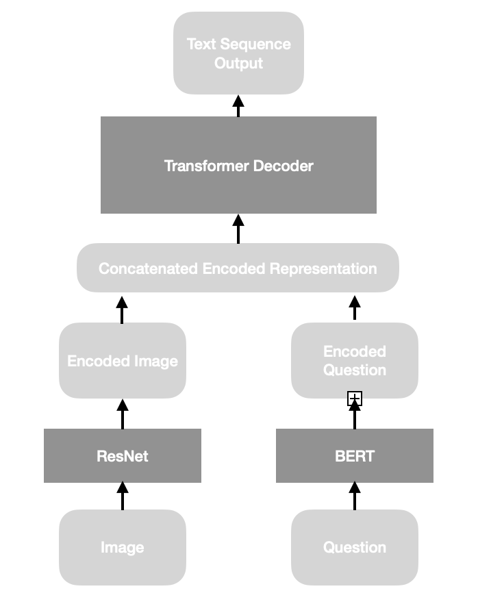

<h1>
    Visual Question Answering 
</h1>
<h4>
    Rishanth Rajendhran
</h4>
 

<h5>
    Datsets
</h5>

    <ul>
        <li>
            <a href="https://visualqa.org/download.html">
                VQA dataset
            </a>
        </li>
    </ul>

<h5>
    At the outset
</h5>

    This repository contains the code for a individual project done as a part of the course
    ECE 6960 Deep Learning for Image Analysis by Professor Tolga Tasdizen at The University of Utah. 

 

<h5>
    Description
</h5>

    Given an image and a question about that image in natural language, the task is to provide an answer to the question in natural language.

    With the advent of ChatGPT, there is a growing interest in models that can communicate with lay-users who may use different kinds of inputs such as natural language text, visual images, videos, code, links etc while conversing with these models. While natural language understanding and generation has made significant strides ever since the paper “Attention is all we need” which introduced attention and transformers came out, there is still a large scope for improvement in the performance of multi-modal models, for instance models which take both text and images as input. 

    There is also a growing interest in extracting common sense knowledge which could be invaluable in many tasks such as machine translation, question answering and word sense disambiguation. One line of work focusses on harvesting common sense knowledge from large-scale language models such as OPT, T5 etc as they have been trained on large amounts of text corpora. Another source of common sense knowledge are images which are also available in large quantities on the internet. Models with visual understanding can thus be used to harvest common sense knowledge as well. 

    In this regard, visual question answering is a task that not only tests natural language understanding that models possess but also their visual understanding. An ablation study performed by the authors of the paper that introduced the dataset used in this project revealed that while 40% of the questions can be answered with just the question, providing the associated image nearly doubles the performance of the model. While a sizable fraction of the question could be answered with just word knowledge (all the more reason why common sense knowledge extraction is an important research area), being able to understand images helps the models do even better.

 

<h5>
    Data Statistics
</h5>

    Due to limited compute resources, a limited number of examples were sampled from the original train and validation sets. The test set was not used as it did not have gold answers. A fraction of the validation set was used as the test set.

 

    <table>
        <caption>
            VQA Dataset (Graphcore_VQA on Huggingface)
        </caption>
        <tr>
            <th>
                Dataset
            </th>
            <th>
                No. of examples
            </th>
            <th>
                Size of vocabulary
            </th>
        </tr>
        <tr>
            <th>
                Train
            </th>
            <td>
                45000
            </td>
            <td>
                1.05693
            </td>
            <td>
                2167
            </td>
        </tr>
        <tr>
            <th>
                Validation
            </th>
            <td>
                45000
            </td>
            <td>
                1.05636
            </td>
            <td>
                2161
            </td>
        </tr>
        <tr>
            <th>
                Test
            </th>
            <td>
                11250
            </td>
            <td>
                1.0616
            </td>
            <td>
                865
            </td>
        </tr>
        <footer>
            Not that only about 10% of the original datasets were used due to limited compute resources.
        </footer>
    </table>

 

    A large majority of the answers (~95%) were one word long and only a few (~3-4%) were two/three words long. About 1% of the answers were longer than three words.

 

    No data augmentation was used as they are not suitable for this dataset. The ground truth may change depending on orientation, angle and color, depending on what the question is about. Random cropping might remove the object the question is about. Horizontal and vertical flipping can change the position of objects in the image which may pose a problem if the question uses that information (eg. what is the color of the hat the person in the top-right corner is wearing?)

<h5>
    Model
</h5>

    The paper that introduced this dataset made use of some convolution layers followed by a multi-layer perceptron (the last hidden layer of VGGNet) to encode the images and two LSTM layers to encode the natural language question. The overall design of the model used in this project is somewhat similar: ResNet is used to encode the image, BERT model is used to encode the question, the encoded representations are concatenated together before being fed to a transformer decoder which then predicts text sequences. 

    While majority of the answers in this datasets were only one word long, for the sake of generality a transformer model capable of predicting text sequences of arbitrary length was used in place of a simple softmax layer over the vocabulary as suggested in the paper.

    Teacher forcing was employed during the training process. Cross entropy loss was used for training with zero weights given to padding, start-of-sequence and end-of-sequence tokens to prioritize getting the answers right. At inference time, tokens were generated one-by-one until the model generated the end-of-sequence token.

    Words from the 300-dimensional Glove embeddings were used to generate the vocabulary for the transformer decoder. All words were lowercased to prevent capitalization issues. An “[UNK]” token was added to the vocabulary to deal with words not in this vocabulary. 

<h5>
    Compute Time
</h5>

    Training: ~15 hours for 20 epochs (on a GPU)
     
    Evaluation: ~0.5 hours (on a GPU)

<h5>
    Results
</h5>

    Accuracy was used to evaluate performance as in the paper that introduced this paper. It was proposed earlier to use F1 scores (Precision and recall) instead of accuracy as it could be a harsh evaluation metric, but after looking at the answer distribution it was decided that accuracy is a good enough measure given than a large majority of the questions are only one word long. 

    <table>
        <caption>
            Performance of model
        </caption>
        <tr>
            <th>
                Dataset
            </th>
            <th>
                Accuracy
            </th>
        </tr>
        <tr>
            <th>
                Train
            </th>
            <td>
                26.27%
            </td>
        </tr>
        <tr>
            <th>
                Validation
            </th>
            <td>
                25.78%
            </td>
        </tr>
        <tr>
            <th>
                Test
            </th>
            <td>
                25.91%
            </td>
        </tr>
    </table>

    Performance is considerably lower than what was reported in the paper eight years ago. There could be several reasons for the poor performance. One, only a small sample (~10%) for the whole dataset was used for training and testing in this project due to limited compute resources. Two, The smallest ResNet model was used as the image encoder. Better performance could have been achieved with larger ResNet models or better models such as InceptionNet. 

<h5>
    Going forward
</h5>

    Both the training and validation accuracies continued to improve with more epochs of training. Due to limited compute resources, training had to stopped after a number of epochs even though neither the training nor the validation accuracy had plateaued or dipped. Better performance could have be achieved with more training. 

    As mentioned before, clearly this task would benefit from using the question to focus on the appropriate objects in the image while generate the feature representation of the image. Again due to limited compute resources, it was opted to simply finteune the pretrained ResNet18 model from torchvision. It would be worth-exploring if using object segmentation models perform better for this task.

    Vocabulary of the transformer decoder is extremely limited (only 40k tokens). This severely restricts what the model can predict. Using word-piece tokenization can help improve the range of the decoder which may lead to better performance.

    Exploring better ways of concatenated the feature representations of the image and that of the questions could prove to be beneficial. In this project, a simple concatenation was performed. Perhaps, a bit-wise multiplication as suggested in the paper would do better. 

<h5>
    Files
</h5>

    <ul>
        <li>
            <h6>
                analyzeData.py
            </h6>
            

                This file is used to print and plot data statistics
            

            

                <h6>
                    Usage
                </h6>
                <pre>
usage: analyzeData.py [-h] [-debug] [-log LOG] [-cacheDir CACHEDIR]
                      [-valTestSplit VALTESTSPLIT] [-maxSamples MAXSAMPLES]

optional arguments:
  -h, --help            show this help message and exit
  -debug                Boolean flag to enable debug mode
  -log LOG              Path to file to print logging information
  -cacheDir CACHEDIR    Path to cache location for Huggingface datasets
  -valTestSplit VALTESTSPLIT
                        Percentage split between validation and test sets as a
                        fraction
  -maxSamples MAXSAMPLES
                        Maximum no. of samples to be used in
                        train/validation/test sets (Memory constraints)
                </pre>
            

        </li>
        <li>
            <h6>
                analyzeResults.py
            </h6>
            

                This file is used to print samples from predictions made by the model besides plotting and reporting performance metrics
            

            

                <h6>
                    Usage
                </h6>
                <pre>
usage: analyzeResults.py [-h] [-debug] [-log LOG] [-predictions PREDICTIONS]
                         [-numSamples NUMSAMPLES] [-vocab VOCAB]

optional arguments:
  -h, --help            show this help message and exit
  -debug                Boolean flag to enable debug mode
  -log LOG              Path to file to print logging information
  -predictions PREDICTIONS
                        Path to file containing predictions to visualize
  -numSamples NUMSAMPLES
                        No. of predictions to visualize
  -vocab VOCAB          Path to file containing Decoder vocabulary
                </pre>
            

        </li>
        <li>
            <h6>
                trainModel.py
            </h6>
            

                This file is used to train model
            

                <h6>
                    Usage
                </h6>
                <pre>
usage: trainModel.py [-h] [-debug] [-log LOG] [-cacheDir CACHEDIR]
                     [-valTestSplit VALTESTSPLIT] [-batchSize BATCHSIZE]
                     [-maxSamples MAXSAMPLES] [-maxLen MAXLEN]
                     [-preTrainedModel PRETRAINEDMODEL] [-numEpochs NUMEPOCHS]
                     [-learningRate LEARNINGRATE] [-weightDecay WEIGHTDECAY]
                     [-imageSize IMAGESIZE] [-numAttnHeads NUMATTNHEADS]
                     [-numLayers NUMLAYERS] [-vocab VOCAB] [-generateVocab]
                     [-load LOAD]

optional arguments:
  -h, --help            show this help message and exit
  -debug                Boolean flag to enable debug mode
  -log LOG              Path to file to print logging information
  -cacheDir CACHEDIR    Path to cache location for Huggingface datasets
  -valTestSplit VALTESTSPLIT
                        Percentage split between validation and test sets as a
                        fraction
  -batchSize BATCHSIZE  Batch size of dataloader
  -maxSamples MAXSAMPLES
                        Maximum no. of samples to be used in
                        train/validation/test sets (Memory constraints)
  -maxLen MAXLEN        Maximum length of question sequence input to BERT
                        model
  -preTrainedModel PRETRAINEDMODEL
                        Pretrained BERT model to use from transformers package
  -numEpochs NUMEPOCHS  Number of epochs to train model for
  -learningRate LEARNINGRATE
                        Learning rate for optimizer
  -weightDecay WEIGHTDECAY
                        Weight Decay for optimizer
  -imageSize IMAGESIZE  Target Size of image [(3, imageSize, imageSize)]
  -numAttnHeads NUMATTNHEADS
                        No. of attention heads in the decoder transformer
                        layer
  -numLayers NUMLAYERS  No. of decoder transformer layers in the decoder block
  -vocab VOCAB          Path to file containing Decoder vocabulary
  -generateVocab        Boolean flag to enable generation of Decoder
                        vocabulary from train set labels
  -load LOAD            Path to file containing model to load
                </pre>
            

        </li>
        <li>
            <h6>
                testModel.py
            </h6>
            

                This file is used to test the model (perform inference)
            

            

                <h6>
                    Usage
                </h6>
                <pre>
usage: testModel.py [-h] [-debug] [-log LOG] [-cacheDir CACHEDIR]
                    [-valTestSplit VALTESTSPLIT] [-batchSize BATCHSIZE]
                    [-maxSamples MAXSAMPLES] [-maxLen MAXLEN]
                    [-preTrainedModel PRETRAINEDMODEL] [-imageSize IMAGESIZE]
                    [-vocab VOCAB] [-load LOAD]

optional arguments:
  -h, --help            show this help message and exit
  -debug                Boolean flag to enable debug mode
  -log LOG              Path to file to print logging information
  -cacheDir CACHEDIR    Path to cache location for Huggingface datasets
  -valTestSplit VALTESTSPLIT
                        Percentage split between validation and test sets as a
                        fraction
  -batchSize BATCHSIZE  Batch size of dataloader
  -maxSamples MAXSAMPLES
                        Maximum no. of samples to be used in
                        train/validation/test sets (Memory constraints)
  -maxLen MAXLEN        Maximum length of question sequence input to BERT
                        model
  -preTrainedModel PRETRAINEDMODEL
                        Pretrained BERT model to use from transformers package
  -imageSize IMAGESIZE  Target Size of image [(3, imageSize, imageSize)]
  -vocab VOCAB          Path to file containing Decoder vocabulary
  -load LOAD            Path to file containing model to load
                </pre>
            

        </li>
    </ul>

<h5>
    Literature Review
</h5>

    <ul>
        <li>
            <a href="https://arxiv.org/pdf/1505.00468.pdf">
                VQA: Visual Question Answering (ICCV 2015)
            </a>
        </li>
    </ul>

